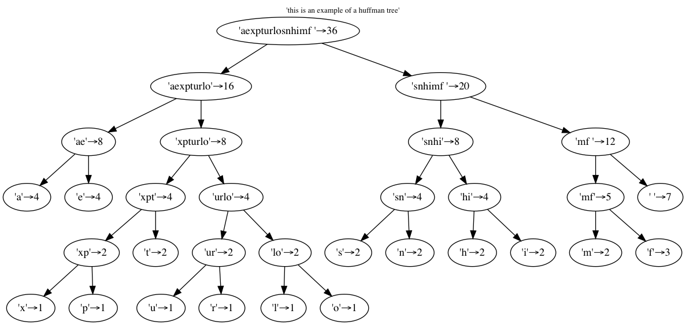
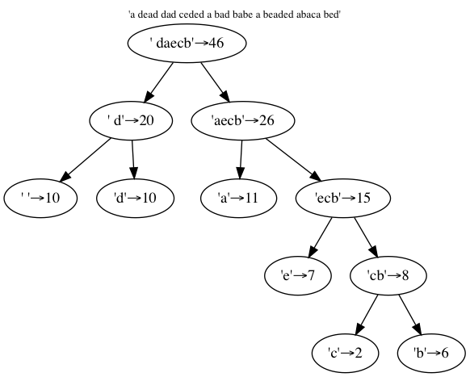

# Évaluation cours Python avancé 


## Critères de correction

Le barême pour ce devoir est délibérément conçu pour vous inciter à faire **très attention à la forme** autant qu'au fond; ainsi les points obtenus se répartissent de la façon suivante :

* 50% seulement de la note sur **le fait que "ça marche"**, c'est-à-dire que les résultats obtenus correspondent bien à ce qui est demandé ;

* 20% de la note sur **la lisibilité du code**; vous êtes notamment invités à 
  * suivre les recommandations de la PEP008 (cf. [le cours sur nbhosting](https://nbhosting.inria.fr/auditor/notebook/python-slides:slides/slides/03-4-pep008)) notamment en ce qui concerne la **place des espaces**, et la **largeur des pages** (ne pas dépasser 100 caractères de large)
  * écrire des *doctrings* pour les classes et méthodes importantes ;
  * insérer ni trop, ni trop peu de commentaires ;
  * utiliser les *type hints* pour préciser le type des arguments lorsque vous pensez que ça peut clarifier l'usage du code que vous écrivez ;

* 20% de la note pour la **simplicité** et la **concision** du code : plus votre code est simple et concis, plus il est facile à lire et à comprendre, et plus il sera facilement modifiable dans le futur ; n'hésitez pas à enlever les étapes inutiles, ou à récrire un morceau qui utilise une approche infructueuse ;

* 10% de la note sur **le respect des consignes** en ce qui concerne les noms de fichier, de classes, et de méthodes, du repo git, etc… dont le non-respect ralentit la correction.

On recommande évidemment de lire l'énoncé jusqu'au bout avant de se lancer.


## Mode d'emploi

* **description des algorithmes** les deux algorithmes qu'on vous demande d'implémenter sont très classiques; **ne cherchez pas dans l'énoncé** une description détaillée de leur fonctionnement, cela fait partie du devoir que d'aller sur toutes les sources que vous jugez utiles pour trouver des descriptions plus fines de leur fonctionnement ;

* **date limite** la date limite est fixée au **27 Janvier 2020 à minuit**; donc après le dernier cours du cyle qui a lieu le 15 Janvier 2020, et pendant lequel une seconde séance de tutorat sera organisée ;

* **modalités de rendu** les copies seront **ramassées sur github.com**; on vous recommande de travailler sous git localement, et de **pousser** votre repo local **sur github.com pendant le week-end** suivant la deadline, pour éviter d'exposer votre travail trop tôt; chacun créera sur github un repo qui s'appelle `python-eval`; la correction se basera sur le dernier commit avant la *deadline* ;

* **révisions** en cas de typo, d'erreur ou d'imprécision trouvée dans l'énoncé, une mise à jour sera publiée sur nbhosting et une annonce sera faite sur discourse.


***
***
***


## Partie 1: Algorithme de Needleman-Wunsch

Cet algorithme ([page wikipedia](https://fr.wikipedia.org/wiki/Algorithme_de_Needleman-Wunsch))
a été inventé pour formaliser la notion de *distance* entre deux brins d'ADN, 
cette distance étant exprimée en nombre de substitutions/insertions/effacements d'un caractère.

Il est important de souligner à ce stade que la page **wikipedia** fait référence à une notion d'**alignement**, alors que **dans cet énoncé** nous parlons de **distance**; il s'agit de la même notion, mais vue de deux points de vue différents; pour faire court, l'alignement est un peu l'opposé de la distance, en ce sens que l'alignement est grand c'est que la distance est faible.


Voici les résultats attendus de cet algorithme sur quelques exemples :


NB. Les signes <span style="color:red; background-color:#ccc">=</span> sont ajoutés par l'algorithme pour permettre une comparaison visuelle des deux chaines;  
Dit autrement, le premier exemple compare les chaines `"abcdefghi"` et `"abcdfghi"`

<code>
<pre>
====== example # 1 - distance = 1
abcdefghi
abcd<span style="color:red; background-color:#ccc">=</span>fghi
====== example # 2 - distance = 2
abcdefg<span style="color:red; background-color:#ccc">=</span>
abcd<span style="color:red; background-color:#ccc">=</span>fgh
====== example # 3 - distance = 1
as de <span style="color:red; background-color:#ccc">♤</span>
as de <span style="color:red; background-color:#ccc">♡</span>
====== example # 4 - distance = 1
AC<span style="color:red; background-color:#ccc">G</span>T
AC<span style="color:red; background-color:#ccc">C</span>T
====== example # 5 - distance = 1
AC<span style="color:red; background-color:#ccc">=</span>GTAGC
ACTGTAGC
====== example # 6 - distance = 2
AC<span style="color:red; background-color:#ccc">T</span>GCCAAC
AC<span style="color:red; background-color:#ccc">C</span>G<span style="color:red; background-color:#ccc">=</span>CAAC
====== example # 7 - distance = 3
A<span style="color:red; background-color:#ccc">=</span>CTGC<span style="color:red; background-color:#ccc">C</span>AACAGTC
ACCTGC<span style="color:red; background-color:#ccc">G</span>AACAG<span style="color:red; background-color:#ccc">=</span>C
</pre>
</code>


Notre modèle un peu simplifié de distance consiste donc à compter le nombre minimum d'opérations élémentaires (insertion d'une lettre, destruction d'une lettre, remplacement d'une lettre) qui permet de passer d'une chaine à l'autre :
  * le remplacement d'une lettre par une autre différente "*coûte*" 1
  * une insertion/effacement "*coûte*" 1 également  

Vous remarquerez que dans la version décrite dans wikipedia, on se place dans un modèle plus général; au lieu d'appliquer un coût forfaitaire comme nous le faisons ici, on introduit une matrice qui permet de donner un coût spécifique et individualisé; ainsi le remplacement de 'A' par 'T' peut être compabilisé différemment d'un remplacement de 'A' par 'C', etc… 

Notre simplification, par exemple dans le cas des brins d'ADN ou l'alphabet correspond aux nucléotides {A, C, G, T}, consisterait ainsi à prendre pour ces deux valeurs (toujours avec les notations de wikipedia) :

  $d = 1$ et 
  $S = \begin{pmatrix}
  0&1&1&1\\ 
  1&0&1&1\\ 
  1&1&0&1\\ 
  1&1&1&0\\ 
  \end{pmatrix}
  $
  
(ou bien, donc, leurs opposées, selon qu'on estime une distance ou un alignement)

<!-- #region -->
### Ce qui est demandé (1)

Pour cette partie on vous demande d'écrire dans un répertoire `needleman_wunsch` un module `ruler.py` qui implémente la classe `Ruler` qui s'utilise comme ceci :

```python
from needleman_wunsch import Ruler

# on crée un objet pour mesurer 
# la distance entre deux chaines
ruler = Ruler("abcdefghi", "abcdfghi")

# on impose à l'utilisateur de la classe 
# de lancer explicitement le calcul
ruler.compute()

# on obtient la distance
print(ruler.distance)

# et pour afficher les différences
top, bottom = ruler.report()
print(top)
print(bottom)
```

pour afficher  

<code>
<pre>
1
abcdefghi
abcd<span style="color:red">=</span>fghi
</pre>
</code>
<!-- #endregion -->

<!-- #region -->
### Ce qui est demandé (2)

En plus de la classe `Ruler`, on vous demande également d'écrire (dans le même répertoire) un module `bundle.py` qui puisse être utilisé depuis le terminal pour calculer et afficher en masse des différences sur un grand nombre de couples de fragments.

Pour cela on veut pouvoir mettre dans un fichier, disons `DATASET`, les couples de chaines qui nous intéressent; par exemple `DATASET` pourrait contenir :

```
abcdefghi
abcdfghi
abcdef
abcdfg
ACGT
ACCT
```

On veut pouvoir lancer notre algorithme sur tous les couples de `DATASET`, en lançant dans le répertoire `needleman_wunsch` la commande

```bash
python3 bundle.py DATASET
```

pour afficher  

<code>
<pre>
====== example # 1 - distance = 1
abcdefghi
abcd<span style="color:red; ">=</span>fghi
====== example # 2 - distance = 2
abcd<span style="color:red; ">e</span><span style="color:red; ">f</span>
abcd<span style="color:red; ">f</span><span style="color:red; ">g</span>
====== example # 3 - distance = 1
AC<span style="color:red; ">G</span>T
AC<span style="color:red; ">C</span>T
</pre>
</code>
<!-- #endregion -->

<!-- #region -->
### Contraintes et précisions

##### Paramétrage et évolutivité du code

* comme on l'a vu en préambule dans tout l'exercice on compte un coût de 1 pour une substitution et de 1 pour une insertion; on vous demande toutefois d'écrire un code qui soit facilement modifiable à cet égard; 
* vous êtes invités notamment (bonus) à discuter - sans forcément implémenter - les moyens que l'on pourrait envisager pour rendre cet aspect du problème paramétrable.

##### Dimensionnement
* on envisage d'utiliser l'algorithme avec en entrée des chaines d'une taille jusqu'à 3 000 caractères
* il est souhaitable que la comparaison de deux chaines toutes deux de taille 1000 se fasse plus vite que dans un délai de l'ordre de 3 secondes.

##### Format des fichiers d'entrées
* le fichier d'entrées peut bien sûr contenir autant de lignes qu'on veut,
  * et si le nombre de lignes est impair, on ignore silencieusement la dernière ligne orpheline ;
* par commodité on pourra (bonus) ignorer les lignes vides, 
  ainsi on pourra écrire des fichiers d'entrée plus lisibles en séparant les paires par des lignes blanches.

##### Robustesse
* il n'est pas demandé de vérifier que l'utilisateur utilise bien la classe comme elle a été conçue (par exemple, demander la distance sur un objet qui n'a pas exécuté `compute()` rend un résultat indéterminé) ; 
* vous *pouvez* (bonus) si vous le souhaitez, implémenter des garde-fou et lever des exceptions lorsque ce n'est pas le cas ;
* de manière similaire, on ne vous demande pas de traiter autre chose que des objets de type `str`, 
mais vous pouvez (bonus) faire en sorte qu'il puisse s'appliquer aussi à, par exemple, des `bytes` 
(il faut cependant bien entendu que les deux fragments comparés soient de même type).


##### Bibliothèques
* pour cet exercice on s'interdit de recourir à une bibliothèque tierce qui ferait le travail à notre place
* on s'autorise par contre à utiliser `numpy`
* et également pour afficher le texte en rouge, comme sur nos exemples, l'utilisation d'une bibliothèque tierce est autorisée (voir aussi l'indice suivant à ce sujet)

##### Indice concernant le texte en couleur
* pour produire un fragment de texte en rouge, la méthode recommandée consiste à s'inspirer du code suivant
<!-- #endregion -->

```python
from colorama import Fore, Style

def red_text(text):
    return f"{Fore.RED}{text}{Style.RESET_ALL}"

# que l'on peut utiliser comme ceci
message = "def"
print(f"abc{red_text(message)}ghi")

```

***
***
***


## Partie 2 : codage de Huffman

Le codage de Huffman ([page wikipedia](https://fr.wikipedia.org/wiki/Codage_de_Huffman)) est un principe de codage qui vise à compresser une donnée textuelle en tirant profit de la fréquence des lettres, pour ensuite utiliser des codes plus courts pour les lettres les plus fréquentes.

En partant d'une phrase, on construit un arbre binaire à partir des occurrences de chaque caractère dans le texte ; le résultat de cette opération est que les caractères fréquents (sur le premier exemple, l'espace, le `a` et le `d`) sont les plus près de la racine.


Voici l'arbre obtenu avec le même exemple que wikipedia :




Ou encore sur un exemple un peu plus simple :




Le codage à proprement parler de la phrase est dérivé de l'arbre de la façon suivante. À chaque lettre/feuille dans l'arbre on va associer une liste de `0` et `1` qui codent le chemin depuis la racine à la feuille en question, avec `0` correspondant à fils gauche - et donc `1` à fils droit.

Ainsi sur ce dernier exemple :
* l'espace ` ` sera codé par la séquence `00` (fils gauche du fils gauche de la racine)
* le `a` est codé `10` (fils gauche du fils droit de la racine)
* le `b` est codé `1111`

et ainsi la phrase entière  
`a dead dad ceded a bad babe a beaded abaca bed`  
sera encodée par  
<span style="font-size:small">1000011101001000110010011101100111001001000111110010011111011111100010001111110100111001001011111011101000111111001</span>


### ce qu'on vous demande (1)

on vous demande d'écrire dans un répertoire `huffman` un module `codec.py` que l'on peut utiliser de la façon suivante :


```python
from codec import TreeBuilder, Codec

text = "a dead dad ceded a bad babe a beaded abaca bed"

# on analyse les fréquences d'occurrence dans text
# pour fabriquer un arbre binaire
builder = TreeBuilder(text)
binary_tree = builder.tree()


# on passe l'arbre binaire à un encodeur/décodeur
codec = Codec(binary_tree)
# qui permet d'encoder
encoded = codec.encode(text)
# et de décoder
decoded = codec.decode(encoded)
# si cette assertion est fausse il y a un gros problème avec le code
assert text == decoded

# on affiche le résultat
print(f"{text}\n{encoded}")
if decoded != text:
    print("OOPS")
```


qui doit alors produire comme sortie


<code>
<pre style="font-size:small">
a dead dad ceded a bad babe a beaded abaca bed
1000011101001000110010011101100111001001000111110010011111011111100010001111110100111001001011111011101000111111001
</pre>
</code>


Redit autrement, si on appelle `Node` le type des objets 'arbre binaire' :

* `TreeBuilder(text: str)` construit une classe capable de construire un arbre binaire
* `tree_builder.tree() -> Node` construit effectivement l'arbre binaire
* `Codec(tree: Node)` construit une instance de codec (i.e. codeur/décodeur)
* `codec.encode(text: str) -> str` retourne le texte `text` encodé avec l'arbre binaire du codec
* `codec.decode(code: str) -> str` retourne le code `code` décodé avec l'arbre binaire du codec


### Remarques et précisions

* en pratique on n'est pas obligé d'utiliser un arbre/code qui est construit à partir du texte à encoder; on peut imaginer par exemple estimer une bonne fois les fréquences relatives des lettres dans le français, et en déduire un codage, qu'on utilise ensuite tel quel ; cependant pour l'exercice on se contente de ce mode de fonctionnement


### Ce qu'on vous demande (2) **(bonus)**

Remarquez qu'on construit ici le code **à base de caractères** `0` et `1`; on fait ce choix pour ne pas alourdir le sujet, mais bien entendu pour être utile en pratique, il resterait à convertir notre code sous la forme plus compacte où on rangerait ces 0 et 1 **dans des bits**, ce qui permettrait d'occuper 8 fois moins de place !

En bonus, vous pouvez implémenter également 

* `codec.encode_bin(text: str) -> bytes` retourne le texte `text` encodé avec l'arbre binaire du codec, mais où les `0` et `1` sont rangés dans des octets comme c'est prévu dans l'algorithme original, de manière à effectivement constater un taux de compression
* `codec.decode_bin(code: bytes) -> str` retourne un code binaire `code` décodé avec le codec

Cette partie est relativement difficile, mais conseillée à ceux d'entre vous qui sont arrivés en début d'année avec déjà un bon niveau en Python ; même en l'absence de résultat fonctionnel, n'hésitez pas à indiquer les voies envisagées et les problèmes rencontrés.
